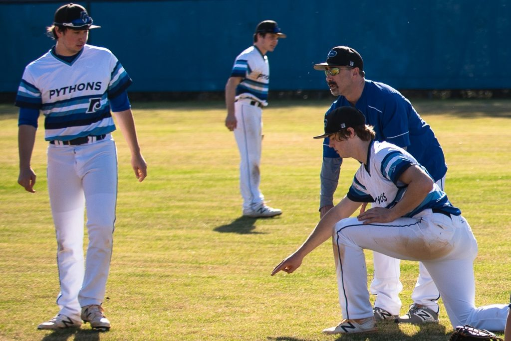

>We're all told at some point in time that we can no longer play the children's game, we just don't know when that's gonna be. 
Some of us are told at eighteen, some of us are told at forty, but we're all told. - Moneyball (Movie)

One of the saddest things to see in baseball and sports in general is the end of a career (playing or coaching) after someone has invested their life into the sport. For most, that happens after Highschool and for a "lucky" few, it happens later. Whether that be college, the minor leaues or MLB. Some athletes and coaches have to stop competing becuase they are just not good enough, but some players have to stop for other reasons. Some lose their love for the game, or find themselves sidelined by injury for longer than they are playing. However, far too often, the reason that players stop playing and coaches stop coaching is for another reason, they need some stability. 

The life of a professional baseball player or coach is hard. It involves a lot of travel with relatively little pay. For many young players and coaches, this is not a deal breaker. Their love for the game outways the long bus rides, terrible living conditions, legally questionable low pay and the neccesity to work two jobs. However, even these individuals have a breaking point.

By the time players enter the minor leagues or become coaches, new obligations arise. Specifically, many start families. This makes having a stable pay check, staying in one city, and geting home at a resonable hour more important. The sacrifices they make to stay in the game become bigger until they can no longer bear them. Passionate exceptional coaches and players trade in their jerseys to become disinterested corprate 9-5ers.

One of the biggest reasons that OwnYourGame is being created is to alleviate some of the burdens that MILB players and coaches face. OwnYourGame will provide the opportunity for players and coaches to have a secondary source of income that allows them to stay in baseball. Rather than working odd jobs to make ends meet college assistant coaches can be coaches after they get home from the field. They can offer remote coaching opportunities, teach the local Highschool kids or give talks to local rec ball coaches, so they can help their kids and leave a mark on the next generation. MILB players can give private lessons to kids all over the nation from the mobile network on the bus to their next game. OwnYourGame is no way a solution to the difficulties that these coaches and players have to deal with everyday, but it can allieviate some of their pain. 

